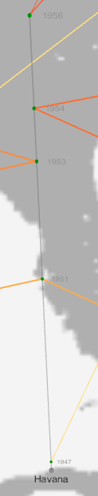

# Introduction
[“Katherine Dunham’s Global Travel, 1947-60 (Interactive Space-Time Aquarium)”](https://dunhamsdata.org/portfolio/visualizations/katherine-dunhams-global-travel-1947-60) is a web-based solution to visualize the manually-curated Everyday Itinerary Dataset (available from [NADAC](https://doi.org/10.3886/ICPSR37698)). Spatializing this data while maintaining chronology allows us to see the architecture of choreographer Katherine Dunham’s global travels, including the locations to which she regularly returned. Time is represented as elevation, with 1947 closest to the earth rising to 1960 farthest away.

This interactive tool is mainly composed of four types of elements: a globe, points, paths, and labels. A key initial decision was to choose how these components will be rendering the data. Points are cylindrical objects growing up perpendicularly from the surface of the globe; each one represents an individual vertical timeline for a visited place. Paths are displayed as floating lines connecting points at specific heights; they depict trips between two places. Labels provide contextual information, mainly city names and travel dates. Regarding interaction, the user can rotate the globe, zoom, hover to display information tooltips, and click to highlight elements, among others. Thanks to these sets of elements and interactive actions, this tool empowers geographical thinking as it helps to explore the globe in detail by regions and easily make connections between them.

The process of creating the 3D globe has two key steps: data wrangling and web-based visualization. First, the information is extracted from the Everyday Itinerary Dataset and then transformed to feed the globe. Second, a web interface is designed to visualize the data in the form of an interactive globe. The data required for the components are:
- For points: geolocation (latitude, longitude, and altitude) of visited places. The point’s altitude is proportional to the last visit date, measured in number of days elapsed since January 1<sup>st</sup>, 1947.
- For paths: pairs of places represented by their geolocation. The altitudes here are relative to when the places were specifically visited, again measured in number of days elapsed since January 1<sup>st</sup>, 1947.
- For labels: label geolocation and text to display.


# Preparing the data
The Everyday Itinerary is the source dataset that contains all the necessary information for points, paths, and labels.[^labels] It is stored on Google Sheets, however, a local copy is downloaded for its analysis. I chose Python and, more specifically, Pandas for my data processing because it makes managing tabular data very simple. I wrote my scripts in Jupyter Notebooks for its ease of creating and sharing my codes and results. The notebooks with the source code and the data can be found on [GitHub](https://github.com/DunhamsData/Globe).

[^labels]: For detailed information on this dataset, refer to the [“Dunham's Data Everyday Itinerary Dataset User Guide”](https://www.dunhamsdata.org/sites/default/files/2023-04/37698-DunhamsDataEverydayItineraryUserGuide.pdf).

I started the data preparation by manually collecting the geolocation of every visited place through respective web searches and adding it to the itinerary dataset (see notebook [02](https://github.com/DunhamsData/Globe/blob/master/02-itinerary.ipynb), cell [9]). Then I compressed every consecutive row associated with the same place into a single row where I recorded the corresponding start and end dates and the stay length (roughly, the number of consecutive rows[^rows]) of that particular visit to that place ([02](https://github.com/DunhamsData/Globe/blob/master/02-itinerary.ipynb) [11]). The following sample tables exemplify this preliminary data transformation:

[^rows]: We formally defined the stay length as the number of consecutive nights spent in a place. It usually agrees with the number of successive rows in the dataset, but there are cases in which it does not. Read my blog post [“First Things First: Days and Nights”](https://dunhamsdata.org/blog/first-thing-first-days-and-nights) for more information.

<table align="center">
<tr><td>

|#|Date      |City  |
|-|----------|------|
|0|1950-01-01|Paris |
|1|1950-01-02|Paris |
|2|1950-01-03|Paris |
|3|1950-01-04|London|
|4|1950-01-05|Rome  |
|5|1950-01-06|Rome  |

</td><td>&rArr;</td><td>

|#|Start Date|End Date  |Stay Length|City  |
|-|----------|----------|-----------|------|
|0|1950-01-01|1950-01-03|3          |Paris |
|1|1950-01-04|1950-01-04|1          |London|
|2|1950-01-05|1950-01-06|2          |Rome  |

</td></tr>
</table>
<div align="center"><i>Table 1. (a) Everyday Dataset and (b) Stay Dataset</i></div>
<br>

The stay-length data now has a more convenient format to extract the information for the globe. There will be a point for every unique city ([03](https://github.com/DunhamsData/Globe/blob/master/03-globe.ipynb) [14]). I found it most effective to give the points the minimum necessary height relative to the last visit, so that the altitude of each point is proportional to the duration, in number of days, between January 1<sup>st</sup>, 1947 and the final day of the last visit to the city represented by the point ([03](https://github.com/DunhamsData/Globe/blob/master/03-globe.ipynb) [17]).

Every point has several labels associated with it. These labels are the city name and one or more labels indicating the years that place was visited. The point’s height (let us remember a point is rendered as a cylinder) along with the year labels represent a timeline for that place. As mentioned above, every point is geolocated by means of a triple (latitude, longitude, and altitude) and all its associated labels share the same latitude and longitude, but have different altitudes. The city name has an altitude of 0 (just on the ground, see ([03](https://github.com/DunhamsData/Globe/blob/master/03-globe.ipynb) [20]) while years have an altitude proportional to the number of days elapsed since January 1<sup>st</sup>, 1947 ([03](https://github.com/DunhamsData/Globe/blob/master/03-globe.ipynb) [23]), being this date on the ground (just like the city name) and December 31<sup>st</sup>, 1960 on the very top of the cylinder. Figure 1 shows the case of Havana. It has the name on the ground, the label “1947” very close to the ground (indicating a stay from March 28<sup>th</sup> to 30<sup>th</sup>, 1947), “1951” (for a stay on August 5-6, 1951), “1953” (October 7-10, 1953), “1954” (August 20-21, 1954), and the label “1956” (for the last visit to this place on January 1-3, 1956).

<div align="center">



<div><i>Figure 1. Havana’s point and labels</i></div>
</div>
<br>

The paths are initially conceptualized as a succession of destinations on different dates. In this approach, a stay is considered a trip from a place to itself (to that same place) that took “stay-length” days ([03](https://github.com/DunhamsData/Globe/blob/master/03-globe.ipynb) [28]). The following simplified table shows the path construction:

<div align="center">

|#|Latitude|Longitude|Altitude|City         |Date        |
|-|--------|---------|--------|-------------|------------|
|0|40.7127 |-74.0059 |0       |New York City|Jan 1, 1947 |
|1|40.7127 |-74.0059 |20      |New York City|Jan 21, 1947|
|2|39.9528 |-75.1636 |21      |Philadelphia |Jan 22, 1947|
|3|39.9528 |-75.1636 |28      |Philadelphia |Jan 29, 1947|
|4|40.7127 |-74.0059 |39      |New York City|Jan 30, 1947|

<div><i>Table 2. Initial path conceptualization</i></div>
</div>
<br>

The idea is to chain all the rows to form a continuous path with the following structure:

```
City #1 — stay length — City #1 — travel length — City #2 — stay length — City #2 — travel length — City #3 …
```

<div align="center"><i>Diagram 1. Textual representation of paths</i></div>
<br>

Then, cumulative stay and travel lengths are calculated to assign an altitude to each place every time it is visited. The following paths exemplify the information in Table 2:

```
New York City — 20 — New York City — 1 — Philadelphia — 7 — Philadelphia — 1 — New York City …
```

```
New York City, 0  ➤  New York City, 20  ➤  Philadelphia, 21  ➤  Philadelphia, 28  ➤  New York City, 29 …
```

<div align="center"><i>Diagram 2. Example of paths before (top) and after (bottom) calculating altitudes</i></div>
<br>

Finally, I saved point, path, and label data to their respective CSV files for further processing on the web side.


# Web interface
In this process of web design, I used HTML, JavaScript, CSS, and the library jQuery, as well as the main specific library for this interactive visualization, [GlobeGL](https://github.com/vasturiano/globe.gl), a web component that uses spherical projection to represent data visualization layers on a 3D globe. This library is largely built on [ThreeJS](https://threejs.org/), which is in turn based on WebGL, so [make sure your browser supports it](https://get.webgl.org/). Other dependencies are [D3.js](https://d3js.org/) and [Range Slider](https://rangeslider.js.org/). D3.js is a JavaScript library for producing dynamic, interactive data visualizations in web browsers, but here it is only needed for loading the data. Range Slider is a simple JavaScript polyfill used here for controlling the timeline.

The first step is to “import” these libraries in the head of your HTML. I decided to download the latest versions of GlobeGL and ThreeJS and reference my local copies instead of linking them from CDNs. My head section looks like this:

```html
<script src="https://code.jquery.com/jquery-3.6.0.min.js"></script>
<script src="dist/three.js"></script>
<script src="dist/globe.gl.js"></script>
<script src="https://d3js.org/d3.v7.min.js"></script>
```

Then create an empty div object in the body of your HTML and provide a value for its attribute id. This div will be the container of the globe. For example,

```html
<div id="globeDiv"></div>
```

Finally, create the Globe object in your JavaScript code, passing the above div to the initialization function, and assign it to a variable or constant. The following code creates and assigns the object to a constant:

```js
const globe = Globe()(document.getElementById('globeDiv'))
```

Configure the globe by setting up its image and its canvas’ width and height. The globe’s image must be an earth map image, whose map projection has to be equirectangular. I used a 5400x2700px PNG file for this purpose. The canvas’ width and height should be large enough to allow scrolling to the edges of the globe when zooming in. Use the designated globe’s methods and pass appropriate parameters to them. For example,

```js
globe.globeImageUrl('earth-maps/grey.png')
globe.width(window.innerWidth * 2)
globe.height(window.innerHeight * 2)
```

Now load the data (points, paths, and labels) onto the globe. The data was previously saved in CSV format, as explained above. There are many different ways to open a file in JavaScript, but I chose D3’s queue. This method can be leveraged to read data as deferred asynchronous tasks. When all the tasks complete, the queue passes the results to the await callback. For example,

```js
d3.queue()
  .defer(d3.csv, 'data/points.csv')
  .defer(d3.csv, 'data/paths.csv')
  .defer(d3.csv, 'data/labels.csv')
  .await(ready)

function ready(error, pointData, pathData, labelData) {
    …
}
```

On data ready, it needs to be parsed in order to be provided to the globe object in the appropriate format. That is what the function ready in the example above does. Points, paths, and labels must be formatted as arrays of objects. Point objects contain a numerical value for the geo-coordinate attributes lat (latitude), lng (longitude), and altitude. Every path is in turn an array of two arrays, each of them containing three numerical values for the latitude, longitude, and altitude of the path’s origin and destination, respectively. Labels contain the geo-coordinate attributes plus the text to display. A fictitious code for this could be:

```js
var pointArray = [
  { lat: lat1, lng: lng1, altitude: alt1 }, // pt1
  { lat: lat2, lng: lng2, altitude: alt2 }, // pt2
  { lat: lat3, lng: lng3, altitude: alt3 }, // pt3
  …
]

var pathArray = [
  [ [ lat1, lng1, alt1 ], [ lat2, lng2, alt2 ] ], // path1 = [pt1, pt2]
  [ [ lat2, lng2, alt2 ], [ lat3, lng3, alt3 ] ], // path2 = [pt2, pt3]
  [ [ lat3, lng3, alt3 ], [ lat4, lng4, alt4 ] ], // path3 = [pt3, pt4]
  …
]

var labelArray = [
  { lat: lat1, lng: lng1, altitude: alt1, text: text1 }, // label1
  { lat: lat2, lng: lng2, altitude: alt2, text: text2 }, // label2
  { lat: lat3, lng: lng3, altitude: alt3, text: text3 }, // label3
  …
]
```

Once the data objects are created, load them onto the globe. Use the corresponding globe’s methods and pass the arrays of objects to them.

```js
globe.pointsData(pointArray)
globe.pathsData(pathArray)
globe.labelsData(labelArray)
```

Setting the points’, paths’, and labels’ altitudes require an additional step. In the code below, points’ and labels’ altitudes are taken from the value of the attribute altitude. For paths though, the altitude is taken from the last value of the origin and destination arrays.

```js
globe.pointAltitude('altitude')
globe.pathPointAlt(d => d[2])
globe.labelAltitude('altitude')
```

We implemented a color gradient for paths in order to make altitude and the passage of time more visible. Path coloring is, though, optional and user specific, so I purposely left the details out of this document.

Altogether, your web page code should look like the sketch in Appendix A. These are the basics for creating a 3D globe from itinerary data. Read [GlobeGL documentation](https://github.com/vasturiano/globe.gl#globegl) for more examples and detailed information.


# APPENDICES
## APPENDIX A. Simplified web code
```html
<!DOCTYPE html>
<head>
    <script src="https://code.jquery.com/jquery-3.6.0.min.js"></script>
    <script src="dist/three.js"></script>
    <script src="dist/globe.gl.js"></script>
    <script src="https://d3js.org/d3.v7.min.js"></script>
    …
</head>
<body>
    <div id="globeDiv"></div>
    …
    <script>
        const globe = Globe()(document.getElementById('globeDiv'))

        globe.globeImageUrl('earth-maps/grey.png')
        globe.width(window.innerWidth * 2)
        globe.height(window.innerHeight * 2)

        d3.queue()
          .defer(d3.csv, 'data/points.csv')
          .defer(d3.csv, 'data/paths.csv')
          .defer(d3.csv, 'data/labels.csv')
          .await(ready)

        function ready(error, pointData, pathData, labelData) {
          var pointArray = … // parse pointData
          var pathArray = … // parse pathData
          var labelArray = … // parse labelData

          globe.pointsData(pointArray)
          globe.pathsData(pathArray)
          globe.labelsData(labelArray)

          globe.pointAltitude('altitude')
          globe.pathPointAlt(d => d[2])
          globe.labelAltitude('altitude')
        }
        …
    </script>
</body>
```


## APPENDIX B. Source code and data

**Data preparation**:

Input data:
- data/src/1947-60/Dunham 1947-60.xlsx

Notebooks and execution order:
1. 01-everyday.ipynb
1. 02-itinerary.ipynb
1. 03-globe.ipynb

**Web interface**:

Source code: https://github.com/DunhamsData/Globe/tree/master/web


## APPENDIX C. Dependencies
- [Three.js](https://threejs.org/) (local copy)
- [Globe.gl](https://globe.gl/) (modified local copy - licensed under the MIT License, https://github.com/vasturiano/globe.gl/blob/master/LICENSE)
- [D3.js](https://d3js.org/) (only for loading data)
- [jQuery](https://jquery.com/)
- [Range Slider](https://rangeslider.js.org/)
